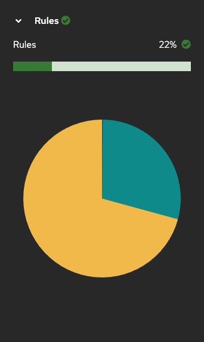

# What is Salesforce Limits? 

Salesforce is a [multitenant cloud solution](https://trailhead.salesforce.com/content/learn/modules/starting_force_com/starting_understanding_arch). It means you need to pay special attention to different limits for avoiding surprises.

You can find many of those limits spread out in the setup or leveraging the standard Salesforce API (tooling api, rest api or limit api). Wouldn't be great to have a dashboard where you could check all this limits at a glance without having to being recolection all this information from your own each time you need them?. Well, that is exactly what Salesforce Limits does.

Salesforce Limits is a Chrome extension, it means, not required to install anything in your org, just a chrome extension!. With this extension you can build your own dashboards with a few clicks, sounds good? keep reading!

# Quick Start

Log into the org you want to annalyse.

Click on the Salesforce Limits extension icon and introduce the Salesforce My Domain without specifying ``https://``. Example ``my-own-domain.my.salesforce.com``.

The extension comes with a default fantastic dashboard for you to use as a template. We encorage you to adapt the dashboard as each org is unique. Keep special atention to the limits you may have as those could be different depending on the purchased Salesforce licenses.

# Things to know

- This extension has nothing to do with Salesforce, it is an external tool for helping you on leverage the api to administer your limits.

- This extension is making usage of api calls. Salesforce has a governor limit that limit the number of api call you can make against an org.

- The request is made under the context of the user logged in Salesforce. As this extension is using the api for collecting information, the user must have api permissions for this extension to work.

- This extension is not collecting any information or sending it to any third party system, if you dont trust my word, have a look to the code, this is open source. 

# Sounds good, I want to customize the dashboard, how can I do it?

You are few minutes await of being a master using this extension!. In the following section you will understand the different report you can build.

You have different kind of report you may use to build your dashboard, you can start by checking the ones created by default or directly create the ones you need from scratch. 

## Entering in edit mode
Before you can start editing the dashboard, you should click on the pencil icon at top right corner

Once in this mode, you could edit, delete or add components to the dashboard, afther editing a dashboard, click on save or revert changes to exit the edit mode.

## Single Api Limit Report

This report type allows you to use the different metrics that the standard [Salesforce api limit](https://developer.salesforce.com/docs/atlas.en-us.api_rest.meta/api_rest/resources_limits.htm) returns.

For example, with this report you can build a report that shows the Data Storage  consumption

For building this component you should create the report using this information:

The limit represent the Limit Label recovered from the [Salesforce api limit](https://developer.salesforce.com/docs/atlas.en-us.api_rest.meta/api_rest/resources_limits.htm)

See [Span](#Span)

See [Thresholds](#Span)

## Select Count Report

This report type is used when the metric can be extracted from a basic ``select count()``, this report just admit one query and one fix limit. 

For example, you can create a report with the usage of permission sets

For building this report you should create the report using this information:

The limit represent the total number of permissions set that can be created at any time in the org.

See [Span](#Span)

See [Thresholds](#Span)

See [Soql](#Soql)

## Multiple Select Count Report

This report type is similar to the last one but allows you to use more than one SOQL. Use this report whenever you need to extract information from different object and makes sense to report them together. This report type shows a pie chart showing the distribution of each Select count.

For example, with this report type you may report how many rules you have in your org. As each rule must be extracted from different object, you need to have different ``Select count`` for each rule

For building this component you should create the report using this information:

Each of this queries may need to be executed against tooling api or not, also you would need to specify a label for the pie chart, that is defined in the Soql Series in a simple json format, where:
- Label is the label that will be shown in the pie chart
- Tooling option, if present, indicates that query need to be exected against tooling api.
- Soql, the soql to execute, this query need to be a select count(), otherwise this report wont work.

See [Span](#Span)

See [Thresholds](#Span)

## Single Aggregated Report

This report type can be used when your metric is based on the number of records recovered from a query. This report aggregates the number of records of each value.

For example, this query provides the fields that are having field history tracking active:

``SELECT EntityDefinitionId FROM FieldDefinition WHERE EntityDefinitionId in ('Account','Case','Contact','Lead','Opportunity') AND IsFieldHistoryTracked = true ``

With this report type you can create following report

For building this report you should create the report using this information:

The limit is fix per all records aggregated

The Aggregate values by field name, specify the field over which the aggregation will be made.

See [Span](#Span)

See [Thresholds](#Span)

See [Soql](#Soql)

## Single Flexible Select Report

This report type can be used when your metric can be extracted with a single query but you can't just use a select count. 

This report is very flexible and allows you to create a single report that summarize other sub-reports.

For example, you can generate a report that shows the limits related to the object Account.

This report provides you several option to extract and transform the information

### Limit - Fix Limit
This limit will set a fix limit to all the records recovered from ddbb. Use this limit when the limit is fix and can not be extracted from the soql

### Limit - From SOQL
This limit lets you specify a field that will provide you the limit value. Use this limit when you can extract the value directly from the ddbb.

Example:

``SELECT Label, Remaining, Max from EntityLimit where EntityDefinitionId ='Contact'``

In this query, the label Max provides you the limit. In this case, you can select From Soql and set the limit with the value "Max" which makes reference to the field name.

### Limit - Map Limit
This limit lets you specify different limits related to values recovered from ddbb. Use this limit whenever you have the label in the query but can't extract the limit.

Example:

``SELECT count(id),LicenseType from SandboxInfo group by LicenseType``

This provides you the number of sanboxes per licenseType. for assignm a different limit per SandboxInfo, you may define following configuration for this limit:

The values FULL, PARTIAL, etc, will match with the label selected. The label must be from Soql in this case.

### Label - Fix Label

Use this label type whenever you want to use the same label for all the metric recovered in the query

### Label - From Soql

Use this label type whenever you want to use the label from a field in the query.

For example, in following query:

``SELECT Label, Remaining, Max from EntityLimit where EntityDefinitionId ='Contact'``

If you want to use the Label field recovered in the query as the label you should configure the limit as follows:

See [Span](#Span)

See [Thresholds](#Span)

See [Soql](#Soql)

See [Transformation](#Transformation)

## Transformation 

Use this section whenever the value is the result of the operation of several fields in the query.

For example, with the following query you may extract the different metrics related to the contact object:

``SELECT Label, Remaining, Max from EntityLimit where EntityDefinitionId ='Contact'``

The usage is the result of substract Max and Remaining. For making this transformation, use following configuration:

## Soql

The Soql Section includes two fields:

- tooling Api - Indicates whether or not the query should be executed against the tooling api

- Soql - The Soql to execute

## Span

Span indicates the width of the report, each rows is divided in 12 blocks. Creating a report with a span of 12 means the whole row will be used by this report. Specifying a span of 6 will use the half and so on.

## Thresholds

Thresholds indicates the application how should consider the information recovered on each report. Each report is splitted in three segments, success, warning and danger. You should define in percentage which value should be considered in which segement.

